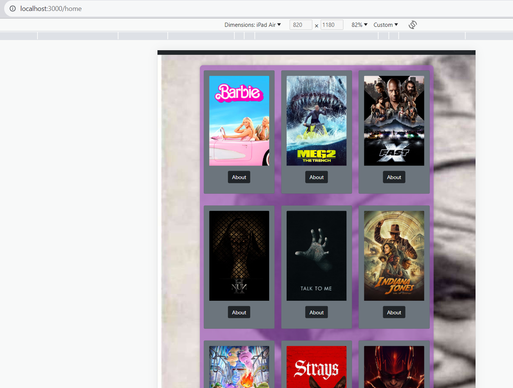

API_URL="https://api.themoviedb.org/3/movie/popular?api_key=6a8aba6c223aa4c5c79fbc541531685e"
API_IMG="https://image.tmdb.org/t/p/w500/"
API_SEARCH="https://api.themoviedb.org/3/search/movie?api_key=6a8aba6c223aa4c5c79fbc541531685e&query"

1.Set Up the Project 
Create a new React or Next.js project using Create React App online commands
Set up the project structure, including directories for components, pages, and services.
2. Design User Interface
Replicate the design from the Figma link  provided for the homepage, movie search results, and movie details pages.
3.Create reusable components for the movie card, search results, and movie details.
Use CSS or a CSS-in-JS solution to style your components based on the design.
Fetching Data from TMDB API
4.Sign up for a TMDB API key by creating an account on the TMDB website.
Create a service or utility function to make API requests to the TMDB API using your API key.
5.Implement fetching the top 10 movies for the homepage and displaying them in a grid layout.
Use the /movie/popular endpoint to fetch popular movies.
6.Display movie posters, titles, and release dates in movie cards.
Implement the movie search feature:
7.Create a search input field.
Make API requests to the /search/movie endpoint to fetch search results based on the user's input.
Display search results, including movie posters, titles, and release dates.
Show a loading indicator while fetching search results.
 Show movie not found if none existent.
8.Create a movie About page that can be accessed via a route like /movies/:id, where :id is the IMDb ID.
Fetch movie details by IMDb ID using the /movie/{movie_id} endpoint.
Display movie details such as title, release date (in UTC), runtime (in minutes), and overview on the movie details page.
9.Implement error handling to display meaningful error messages in case of API failures or other issues.

Set up routing using React Router for navigating between the homepage, search results, and movie details pages.
Hosted the Application using GitHub Pages

used bootstarpas best practices of styling.
